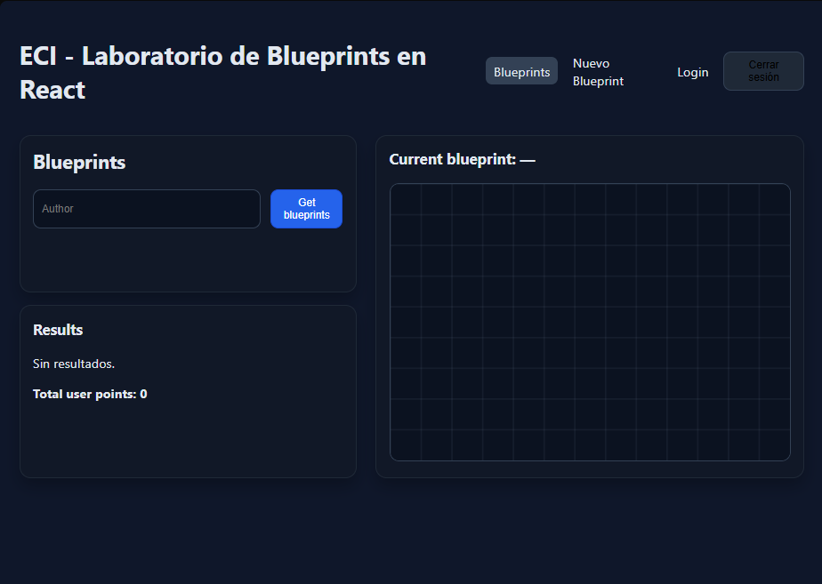
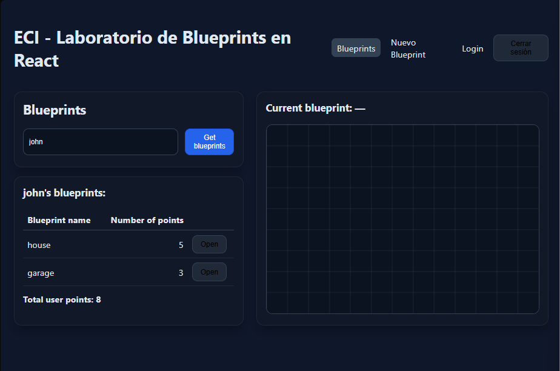
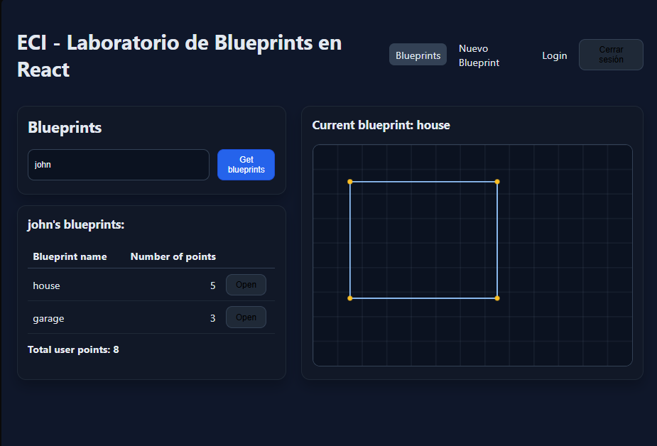
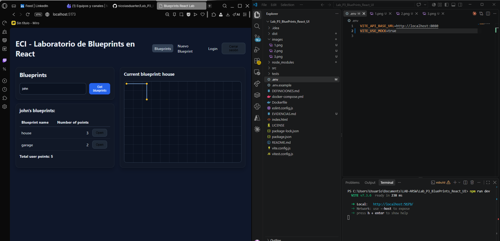
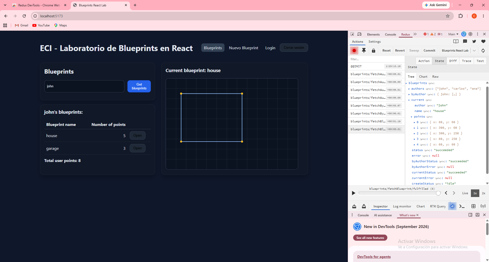
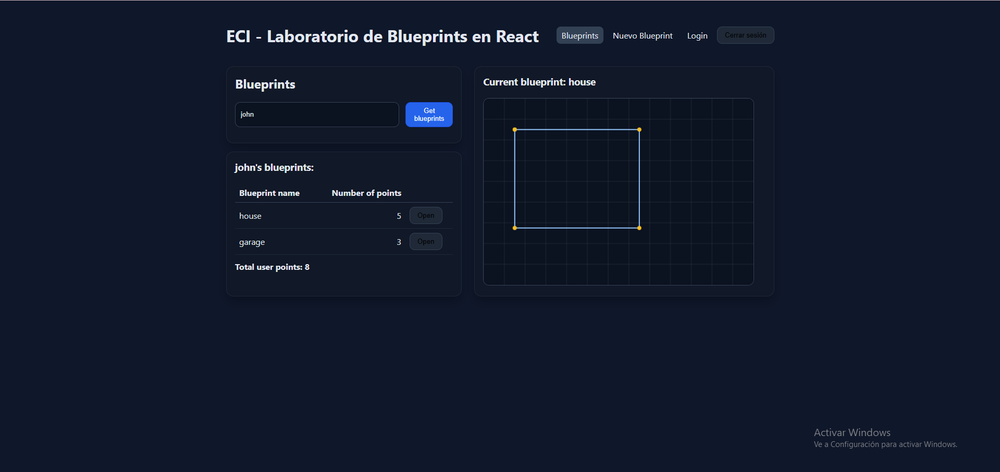
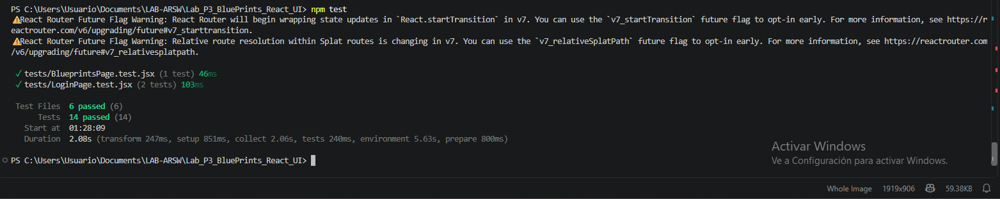
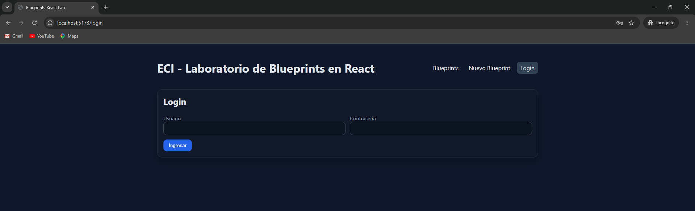
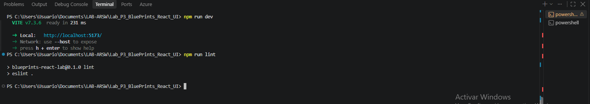
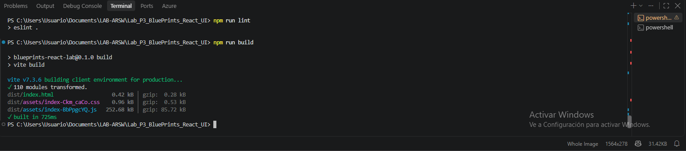

# Evidencias de cumplimiento — Lab Blueprints React

---

## 1. Canvas (lienzo)

El componente `src/components/BlueprintCanvas.jsx` renderiza un `<canvas>` con
`id="blueprint-canvas"` y dimensiones por defecto de **520×360**, con una grilla
de fondo. Sin ningún plano seleccionado, el lienzo se muestra vacío.

---

## 2. Listar los planos de un autor

En `src/pages/BlueprintsPage.jsx` se ingresa el nombre del autor y, al hacer
click en **Get blueprints**, se despacha el thunk `fetchByAuthor`. Los resultados
se muestran en una tabla con el nombre del plano, el número de puntos y un botón
`Open`, junto con el total de puntos del autor.

---

## 3. Seleccionar un plano y graficarlo

Al hacer click en `Open` se despacha `fetchBlueprint`, que guarda el plano en
`blueprints.current` (Redux). El título **Current blueprint** se actualiza con el
nombre del plano y el canvas dibuja los segmentos consecutivos marcando cada punto.

---

## 4. Servicios `apimock` y `apiclient`

`src/services/apimock.js` (datos en memoria) y `src/services/apiClient.js`
(API REST con Axios) implementan la misma interfaz: `getAll`, `getByAuthor`,
`getByAuthorAndName` y `create`. El módulo `src/services/blueprintsService.js`
elige cuál usar según la variable `VITE_USE_MOCK` del archivo `.env`.

Con `VITE_USE_MOCK=true` la app consume el mock: el autor `john` tiene `house`
(3 puntos) y `garage` (2 puntos), datos distintos a los del backend real.

---

## 5. Interfaz con React (estado global)

El blueprint actual vive en el store de Redux (`src/features/blueprints/blueprintsSlice.js`)
y las páginas lo leen con `useSelector`, sin manipular el DOM directamente.
En Redux DevTools se observa `blueprints.current` poblado con el autor, el nombre
y los puntos del plano abierto, además de las acciones despachadas.

---

## 6. Estilos

`src/styles.css` define las tarjetas, los botones con estados hover/active y la
tabla con separación y hover por fila, siguiendo un tema oscuro.

---

## 7. Pruebas unitarias

Pruebas con Vitest + Testing Library. `npm test` ejecuta 6 archivos con 14 pruebas, todas exitosas.

| Archivo de test | Qué valida |
|---|---|
| `BlueprintCanvas.test.jsx` | Renderiza `<canvas>` y llama `getContext` |
| `BlueprintForm.test.jsx` | Envía el formulario con los puntos parseados |
| `BlueprintsPage.test.jsx` | Dispatch de `fetchByAuthor` al hacer click en "Get blueprints" |
| `blueprintsSlice.test.jsx` | Reducers puros: estado inicial, pending/fulfilled/rejected de los thunks |
| `LoginPage.test.jsx` | Login exitoso guarda el token; login fallido muestra error |
| `PrivateRoute.test.jsx` | Redirige a `/login` sin token; muestra el contenido con token |

---

## Seguridad (JWT / interceptores / rutas protegidas)

El interceptor de Axios en `src/services/apiClient.js` agrega
`Authorization: Bearer <token>` a cada petición y, si el backend responde 401,
limpia el token y redirige a `/login`. `src/components/PrivateRoute.jsx` protege
`/`, `/blueprints/:author/:name` y `/blueprints/new`. Al entrar sin sesión
(ventana de incógnito), la app redirige automáticamente a `/login`.

---

## Lint

`npm run lint` ejecuta ESLint sobre todo el proyecto sin reportar errores ni warnings.

---

## Build de producción

`npm run build` genera el bundle de producción con Vite en la carpeta `dist/`.

---

## Resumen

| Requisito | Estado |
|---|---|
| 1. Canvas | ✅ |
| 2. Listar planos por autor | ✅ |
| 3. Seleccionar y graficar | ✅ |
| 4. apimock / apiclient | ✅ |
| 5. Estado global (Redux) | ✅ |
| 6. Estilos | ✅ |
| 7. Pruebas unitarias | ✅ 14/14 |
| Seguridad JWT / rutas protegidas | ✅ |
| Lint | ✅ |
| Build | ✅ |
